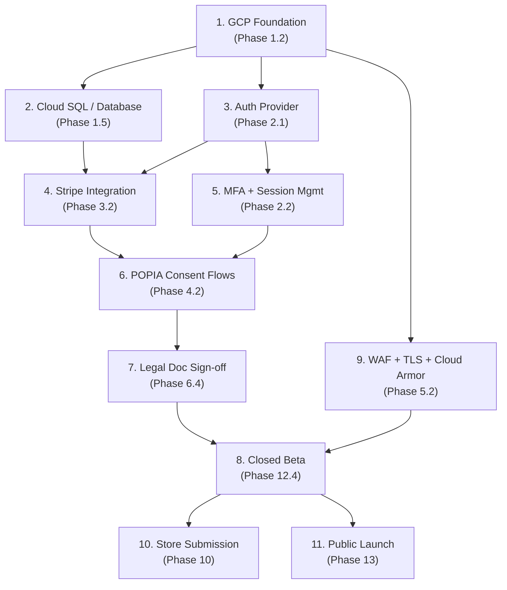

# 📊 Raising Atlantic — Go-Live Progress Report

**Date:** 27 June 2026
**Author:** Auto-generated from [GO_LIVE/](.) checklist audit
**Source docs:** [DEV.md](DEV.md) · [CLINICAL.md](CLINICAL.md) · [COMPLIANCE.md](COMPLIANCE.md) · [DESIGN.md](DESIGN.md) · [FINANCE.md](FINANCE.md) · [LEGAL.md](LEGAL.md) · [MARKETING.md](MARKETING.md) · [OPS.md](OPS.md) · [PRODUCT.md](PRODUCT.md) · [SUPPORT.md](SUPPORT.md)

---

## Executive Summary

### Overall Progress

```
  ████████░░░░░░░░░░░░░░░░░░░░░░  30%
```

| Metric | Count |
| --- | ---: |
| **Total checklist items** | 375 |
| ✅ **Done** | 103 |
| 🔄 **In Progress** | 21 |
| ❌ **Outstanding** | 251 |
| **Effective completion** | **30%** |

> [!IMPORTANT]
> Three phases are **100% complete** (Phase 0, 9, and partially Phase 7). However, **nine phases sit at 0%** — the bulk of pre-launch, compliance, payments, comms, and mobile work is untouched. The project is roughly one-third of the way to go-live.

### Completion by Priority Tier

| Tier | Description | Status |
| --- | --- | --- |
| 🔴 **Required** (non-negotiable before release) | Hosting, Auth, Payments, POPIA, Security, Legal, Observability, Beta | `██░░░░░░░░` **~20%** |
| 🟠 **Tier 1** (release week + first month) | Email, Mobile store, Slack, Helpdesk, Xero | `░░░░░░░░░░` **~0%** |
| 🟡 **Tier 2** (weeks 2–4 post-launch) | SMS/WhatsApp, Push, Ozow, Press kit, Analytics | `░░░░░░░░░░` **~0%** |
| 🟢 **Tier 3** (first quarter post-launch) | KMS encryption, Feature flags, DR drills, GA transition | `░░░░░░░░░░` **~0%** |
| 🔵 **Future work** | African expansion, SOC 2, Multi-region failover | `░░░░░░░░░░` **~0%** |

---

## Phase-by-Phase Progress

| # | Phase | ✅ Done | 🔄 In Prog | ❌ Todo | Total | Progress |
| :---: | --- | ---: | ---: | ---: | ---: | --- |
| 0 | MVP (Baseline) | 14 | 0 | 0 | 14 | `████████████████████` **100%** |
| 1 | Infrastructure & Hosting | 45 | 0 | 43 | 88 | `██████████░░░░░░░░░░` **51%** |
| 2 | Authentication & Identity | 0 | 0 | 16 | 16 | `░░░░░░░░░░░░░░░░░░░░` **0%** |
| 3 | Payments | 0 | 0 | 32 | 32 | `░░░░░░░░░░░░░░░░░░░░` **0%** |
| 4 | POPIA Compliance | 0 | 0 | 20 | 20 | `░░░░░░░░░░░░░░░░░░░░` **0%** |
| 5 | Security | 9 | 0 | 17 | 26 | `███████░░░░░░░░░░░░░` **35%** |
| 6 | Legal Documents | 0 | 17 | 0 | 17 | `██████████░░░░░░░░░░` **50%** |
| 7 | Observability & Monitoring | 11 | 3 | 2 | 16 | `████████████████░░░░` **78%** |
| 8 | Email, SMS & Notifications | 0 | 0 | 13 | 13 | `░░░░░░░░░░░░░░░░░░░░` **0%** |
| 9 | CI/CD & Release Engineering | 21 | 0 | 0 | 21 | `████████████████████` **100%** |
| 10 | Mobile App Release | 0 | 0 | 14 | 14 | `░░░░░░░░░░░░░░░░░░░░` **0%** |
| 11 | Workspace & Communications | 0 | 0 | 22 | 22 | `░░░░░░░░░░░░░░░░░░░░` **0%** |
| 12 | Pre-Launch Testing | 3 | 1 | 13 | 17 | `████░░░░░░░░░░░░░░░░` **21%** |
| 13 | Launch & Marketing | 0 | 0 | 8 | 8 | `░░░░░░░░░░░░░░░░░░░░` **0%** |
| 14 | Post-Launch Operations | 0 | 0 | 13 | 13 | `░░░░░░░░░░░░░░░░░░░░` **0%** |
| 15 | Mobile Feature Parity | 0 | 0 | 38 | 38 | `░░░░░░░░░░░░░░░░░░░░` **0%** |
| | **TOTAL** | **103** | **21** | **251** | **375** | **30%** |

---

## Department Progress Overview

Each department's progress is weighted by their ownership share in each phase. The **Weighted Items** column reflects the department's proportional responsibility.

| Department | Phases Involved | Weighted Items | Weighted Done | Progress |
| --- | --- | ---: | ---: | --- |
| **DEV** | 0–15 (all) | ~248 | ~97 | `████████░░░░░░░░░░░░` **39%** |
| **PRODUCT** | 1, 2, 3, 6, 10, 12, 13 | ~38 | ~1 | `░░░░░░░░░░░░░░░░░░░░` **3%** |
| **LEGAL** | 4, 6 | ~18 | ~6 | `██████░░░░░░░░░░░░░░` **33%** |
| **COMPLIANCE** | 4 | ~10 | 0 | `░░░░░░░░░░░░░░░░░░░░` **0%** |
| **OPS** | 5, 7, 11, 14 | ~20 | ~2 | `██░░░░░░░░░░░░░░░░░░` **10%** |
| **FINANCE** | 3, 14 | ~11 | 0 | `░░░░░░░░░░░░░░░░░░░░` **0%** |
| **DESIGN** | 8, 10, 13 | ~7 | 0 | `░░░░░░░░░░░░░░░░░░░░` **0%** |
| **MARKETING** | 8, 13 | ~7 | 0 | `░░░░░░░░░░░░░░░░░░░░` **0%** |
| **CLINICAL** | 12 | ~4 | 0 | `░░░░░░░░░░░░░░░░░░░░` **0%** |
| **SUPPORT** | 14 | ~4 | 0 | `░░░░░░░░░░░░░░░░░░░░` **0%** |

---

## DEV Deep Dive `████████░░░░░░░░░░░░` 39%

> DEV is the primary driver across all 16 phases. Below is a phase-by-phase breakdown of what DEV has completed and what remains.

### ✅ Phase 0 — MVP `████████████████████` 100%

All 14 items complete. The monorepo, web app, API, mobile scaffold, RBAC, testing tooling, and dual data-source pattern are all shipped. **No further action required.**

### Phase 1 — Infrastructure & Hosting `██████████░░░░░░░░░░` 51% · DEV owns 90%

**What's done (45 items):**
- ✅ Hosting decision (GCP `africa-south1`) documented with ADR
- ✅ Vercel portability inventory + 12-month cost estimate
- ✅ Full Terraform repo layout with `infra/` directory
- ✅ Provider versions pinned, remote state in GCS, per-env state
- ✅ All Terraform provider integrations (GCP, GitHub, Stripe, Cloudflare, Vercel, Neon, SaaS tools)
- ✅ Workload Identity Federation (no JSON keys)
- ✅ GitHub Actions pipelines for plan + apply
- ✅ Secrets management pattern (Secret Manager, `lifecycle.ignore_changes`)
- ✅ Drift detection (nightly cron + OPA/Conftest)
- ✅ Database decision + migration pattern (`synchronize: false`)

**What DEV still needs to do (43 items):**

| Sub-section | Outstanding | Items |
| --- | ---: | --- |
| §1.2 GCP Foundation | 8 | GCP org, billing, projects, APIs, IAM, Org Policies, VPC Service Controls, region lockdown |
| §1.3 Workload Layout | 6 | Cloud Run services (API + Web), Cloud Storage + CDN, Cloud Run Jobs, Pub/Sub email queue, Cloud DNS |
| §1.4 State Bootstrap | 2 | One-time bootstrap module, import bootstrap into TF |
| §1.4 TF Pipelines | 2 | Merged-PR plan reuse, laptop-apply prevention via IAM |
| §1.4 Secrets | 1 | Annual WIF binding rotation |
| §1.4 Full Inventory | 16 | All production resources codified in Terraform |
| §1.4 Drift | 2 | Quarterly review, audit-ready IAM log |
| §1.5 Database | 6 | Neon DPA or Cloud SQL migration, lockdown, credentials, backups, DR drill |

### Phase 2 — Authentication & Identity `░░░░░░░░░░░░░░░░░░░░` 0% · DEV owns 90%

**Nothing started.** This is a critical gap — auth is the gatekeeper for a healthcare product.

**What DEV still needs to do (16 items):**

| Sub-section | Outstanding | Items |
| --- | ---: | --- |
| §2.1 Auth Provider | 3 | Decide provider (Firebase Auth recommended), integrate Admin SDK, wire JwtAuthGuard |
| §2.2 Account Hardening | 9 | Email verification, password reset, MFA (mandatory for clinicians), rate limiting, lockout, session mgmt, logout-everywhere, audit log |
| §2.3 Clinician Verification | 4 | HPCSA/SANC regex, admin review queue, certificate upload to GCS, annual re-verification |

### Phase 3 — Payments `░░░░░░░░░░░░░░░░░░░░` 0% · DEV owns 45%

**Nothing started.** DEV shares this with PRODUCT (30%) and FINANCE (25%).

**What DEV still needs to do (priority items):**

| Sub-section | DEV Items |
| --- | --- |
| §3.1 Decision | Document in ADR |
| §3.2 Stripe Setup | Webhook endpoint, Stripe IDs on entities |
| §3.3 Pricing | Build `/pricing` page with Checkout buttons, trial logic |
| §3.4 Billing UX | Customer Portal embed, invoice UI, upgrade/downgrade, `PaymentProvider` interface |
| §3.5 Compliance | PCI-DSS SAQ-A scope confirmation, Radar setup |
| §3.6 Ozow (post-launch) | Ozow adapter, webhook, reconciliation cron |

### Phase 4 — POPIA Compliance `░░░░░░░░░░░░░░░░░░░░` 0% · DEV owns 20%

**Nothing started.** DEV's role is small but critical — build the DSAR and erasure endpoints.

**What DEV still needs to do:**
- DSAR self-service endpoint (export personal data as JSON + PDF)
- Right to erasure endpoint (soft delete → hard delete)
- Consent versioning in database
- Data portability endpoint

### Phase 5 — Security `███████░░░░░░░░░░░░░` 35% · DEV owns 80%

**What's done (9 items):** All §5.1 Application Security — OWASP audit, Helmet, CORS, input validation, rate limiting, dependency + secret scanning.

**What DEV still needs to do (17 items):**

| Sub-section | Outstanding | Items |
| --- | ---: | --- |
| §5.2 Infrastructure | 7 | WAF (Cloud Armor), DDoS, TLS/HSTS, private VPC, bot management, private-IP DB, no SA JSON keys |
| §5.3 Data Security | 5 | Encryption at rest docs, KMS field-level encryption, PII redaction in logs, pseudonymisation, CMEK backups |
| §5.4 Operational | 5 | 2FA enforcement, YubiKeys, quarterly access review, pen test, bug bounty |

### Phase 6 — Legal Documents `██████████░░░░░░░░░░` 50% · DEV owns 5%

**All 17 items are in-progress** (`[/]`). DEV's only job is hosting final content in the `legal/[slug]` route — currently blocked on LEGAL delivering the documents.

**What DEV still needs to do:**
- Host final lawyer-approved content in `legal/[slug]` pages (blocked on LEGAL)

### Phase 7 — Observability & Monitoring `████████████████░░░░` 78% · DEV owns 95%

**What's done (11 items):** Structured logging, correlation IDs, PII redaction, OpenTelemetry, Cloud Trace, dashboards, Sentry (web + API + mobile), source maps, release tagging, alert routing, uptime checks.

**What's in-progress (3 items):** Custom business metrics, public status page, on-call rotation setup.

**What DEV still needs to do (2 items):**
- Define SLOs (99.5% availability, p95 < 500ms) and error budgets
- Finish on-call rotation and status page configuration

### Phase 8 — Email, SMS & Notifications `░░░░░░░░░░░░░░░░░░░░` 0% · DEV owns 50%

**Nothing started.** Notification ports + dispatcher exist in `src/core/notifications/` (landed 2026-06-02), but no provider is live.

**What DEV still needs to do:**

| Sub-section | Outstanding | Items |
| --- | ---: | --- |
| §8.1 Email | 5 | Choose provider (SendGrid), sending domain setup, templates, bounce handling, unsubscribe headers |
| §8.2 SMS/WhatsApp | 4 | Choose provider (Twilio), WhatsApp API approval, opt-in, stop-word handling |
| §8.3 Push (Mobile) | 4 | Expo Push config, token storage, notification prefs UI, quiet hours |

### ✅ Phase 9 — CI/CD & Release Engineering `████████████████████` 100%

All 21 items complete. CI on every PR, container builds, SBOM/cosign, auto-deploy pipeline (dev → staging → prod), blue/green rollouts, migration safety, infra/app pipeline separation, environment parity, feature flags. **No further action required.**

### Phase 10 — Mobile App Release `░░░░░░░░░░░░░░░░░░░░` 0% · DEV owns 50%

**Nothing started.** The Expo app has never been submitted to a store.

**What DEV still needs to do:**

| Sub-section | Outstanding | Items |
| --- | ---: | --- |
| §10.1 Apple App Store | 6 | Developer Program, App Store Connect listing, EAS Build iOS, TestFlight, ATT, submit |
| §10.2 Google Play | 5 | Play Console, data safety form, EAS Build Android, testing tracks, health-app declaration |
| §10.3 Mobile Compliance | 3 | In-app privacy policy, account deletion, ad ID consent |

### Phase 11 — Workspace & Communications `░░░░░░░░░░░░░░░░░░░░` 0% · DEV owns 40%

**Nothing started.**

**What DEV still needs to do (technical integrations only):**
- Slack webhook integrations: GitHub, Sentry, Stripe, GCP Monitoring, BetterStack
- `@raisingatlantic-bot` slash commands
- `security.txt` publication

### Phase 12 — Pre-Launch Testing `████░░░░░░░░░░░░░░░░` 21% · DEV owns 50%

**What's done (3 items):** Cypress smoke suite on prod deploy, Postman contract tests nightly, Lighthouse > 90.

**What's in-progress (1 item):** Unit test coverage at ~66.55% (target: 70%).

**What DEV still needs to do (13 items):**

| Sub-section | Outstanding | Items |
| --- | ---: | --- |
| §12.1 Automated | 2 | Close unit-test gap to 70%, Mobile E2E (Detox/Maestro) |
| §12.2 Manual | 5 | Internal alpha, clinical accuracy review, a11y audit, multi-language QA, device matrix |
| §12.3 Performance | 3 | k6/Artillery load test, DB slow-query review, Cloud Run cold-start benchmarks |
| §12.4 Closed Beta | 4 | Recruit practices, onboard parents, weekly syncs, exit criteria |

### Phase 13 — Launch & Marketing `░░░░░░░░░░░░░░░░░░░░` 0% · DEV owns 10%

**What DEV still needs to do (DEV-specific only):**
- Open Graph + Twitter card metadata on every public route
- Sitemap + robots.txt + Search Console verification
- Analytics integration (Plausible / PostHog)

### Phase 14 — Post-Launch Operations `░░░░░░░░░░░░░░░░░░░░` 0% · DEV owns 20%

**What DEV still needs to do:**
- Engineering follow-ups from weekly metrics reviews
- Technical contribution to monthly security reviews
- Database restore + failover for quarterly DR drills

### Phase 15 — Mobile Feature Parity `░░░░░░░░░░░░░░░░░░░░` 0% · DEV owns 80%

**Nothing started.** 17 of 18 screens still render `ComingSoon`. This is the largest outstanding phase.

**What DEV still needs to do (38 items):**

| Sub-section | Outstanding | Items |
| --- | ---: | --- |
| §15.2 Mobile Auth | 6 | Real login, `expo-secure-store`, biometrics, refresh tokens, sign-out-everywhere, force-upgrade |
| §15.3 Parent Flows | 7 | Children CRUD, growth records, milestones, vaccinations, triage tools, directory, messages |
| §15.4 Clinician Flows | 5 | Patients list, patient summary, verifications queue, schedule, tenant-scoping |
| §15.5 Shared Data Layer | 7 | Domain hooks port, query-key conventions, persistence, optimistic mutations, offline banner, error boundaries, env flag |
| §15.6 Mobile-First | 6 | Push notifications, deep linking, camera, document scan, app-state lock, Sentry-mobile |
| §15.8 Definition of Done | 7 | No `ComingSoon`, TestFlight builds, Detox/Maestro E2E, real API, crash-free sessions, tenant boundary test, store form readiness |

---

## Other Departments Deep Dive

### PRODUCT `░░░░░░░░░░░░░░░░░░░░` ~3%

PRODUCT is involved in **7 phases** and has made almost no progress. Most PRODUCT items are decision-making and stakeholder coordination rather than engineering.

**🔴 Required before release:**
- [ ] Sign off on hosting cost trade-offs (Phase 1)
- [ ] Weigh in on auth provider decision (Phase 2)
- [ ] Define pricing tiers, trial logic, coupon strategy (Phase 3)
- [ ] Negotiate B2B MSAs with first practices (Phase 6)
- [ ] Recruit 3–5 paediatric practices for closed beta (Phase 12)

**🟠 Tier 1:**
- [ ] Write App Store + Play Store listing copy (Phase 10)
- [ ] Answer Apple/Google data-safety forms (Phase 10)

**🟡 Tier 2:**
- [ ] Finalise pricing copy and demo flow (Phase 13)
- [ ] Ozow as second checkout (Phase 3)
- [ ] Stripe Customer Portal scope (Phase 3)

**🟢 Tier 3:**
- [ ] Open beta → GA transition criteria (Phase 12)

---

### LEGAL `██████░░░░░░░░░░░░░░` ~33%

LEGAL is involved in **2 phases** (4 and 6). All Phase 6 items are in-progress (drafts exist, attorney review pending).

**🔴 Required before release:**
- [ ] Engage SA POPIA + healthtech attorney (Phase 6 — in progress)
- [ ] Privacy Policy — lawyer-reviewed (Phase 6 — in progress)
- [ ] Terms of Service — lawyer-reviewed (Phase 6 — in progress)
- [ ] Disclaimer — lawyer-reviewed (Phase 6 — in progress)
- [ ] Sign-off on parental consent flow (Phase 6 — in progress)

**Phase 4 items (shared with COMPLIANCE):**
- [ ] PIIA documentation (Phase 4)
- [ ] Retention periods per data category (Phase 4)
- [ ] DPA drafting with sub-processors (Phase 4)
- [ ] Breach notification templates (Phase 4)

**Phase 6 in-progress items (17 total):**
- 🔄 Privacy Policy, ToS, Cookie Policy, AUP, Disclaimer
- 🔄 Parent EULA, Clinician Service Agreement, Tenant MSA, DPA
- 🔄 Incident response policy, InfoSec policy, Data retention policy, Staff AUP, Sub-processor DPAs
- 🔄 Attorney engagement, public doc sign-off, consent flow sign-off

---

### COMPLIANCE `░░░░░░░░░░░░░░░░░░░░` 0%

COMPLIANCE owns **50% of Phase 4** (POPIA). Nothing has started.

**🔴 Required before release:**
- [ ] Appoint Information Officer (CEO/Founder default)
- [ ] Register Information Officer with Information Regulator
- [ ] Conduct Personal Information Impact Assessment (PIIA)
- [ ] Maintain Record of Processing Activities
- [ ] Document lawful basis per processing purpose
- [ ] Define retention periods per data category

**Other outstanding items:**
- [ ] Granular consent capture at signup
- [ ] Parental consent flow
- [ ] Sub-processor inventory + DPAs with every processor
- [ ] Breach-notification runbook + tabletop drill
- [ ] Sign DPAs with Stripe, Vercel/GCP, Neon, SendGrid, Sentry, etc.

---

### OPS `██░░░░░░░░░░░░░░░░░░` ~10%

OPS is involved in **4 phases** (5, 7, 11, 14). Progress is limited to observability work started by DEV.

**🔴 Required before release:**
- [ ] Enforce mandatory 2FA on GitHub, GCP, Stripe, Neon, Google Workspace, domain registrar
- [ ] Procure pen-test vendor; schedule pre-launch test
- [ ] Enforce DMARC on `raisingatlantic.com`
- [ ] Publish `security.txt`

**🟠 Tier 1:**
- [ ] Create Slack workspace `raisingatlantic.slack.com`
- [ ] Set up channel layout (#alerts-prod, #deploys, #stripe, etc.)
- [ ] Provision email aliases (support@, security@, privacy@, etc.)
- [ ] Domain auto-renew with backup payment

**🟡 Tier 2:**
- [ ] Set up Linear or Notion for issue tracking
- [ ] Notion for company wiki + SOPs + runbooks
- [ ] 1Password Business for shared secrets
- [ ] Calendly, Loom, DocSend/PandaDoc

**🟢 Tier 3:**
- [ ] Quarterly DR drill + access review cadence
- [ ] Bug bounty (private HackerOne/Bugcrowd)
- [ ] YubiKey rollout for all admins
- [ ] Weekly metrics review, monthly security review

---

### FINANCE `░░░░░░░░░░░░░░░░░░░░` 0%

FINANCE is involved in **2 phases** (3, 14). Nothing has started.

**🔴 Required before release:**
- [ ] Stripe KYC — CIPC company registration + proof of address
- [ ] SARS VAT registration (15%)
- [ ] Configure Stripe Tax for South African VAT

**🟠 Tier 1:**
- [ ] Set up Xero or QuickBooks Online with Stripe integration

**🔵 Future:**
- [ ] R&D Tax Incentive (Section 11D) application
- [ ] SA company tax registration (Income Tax + VAT + PAYE)
- [ ] Founder personal liability ringfencing (Pty Ltd structure)

---

### DESIGN `░░░░░░░░░░░░░░░░░░░░` 0%

DESIGN is involved in **3 phases** (8, 10, 13). Nothing has started.

**🟠 Tier 1:**
- [ ] Branded HTML email templates (welcome, verification, EPI reminder, billing receipt)
- [ ] App Store / Play Store screenshots and icons
- [ ] App icon and splash screen for Expo

**🟡 Tier 2:**
- [ ] Press kit (logo, screenshots, founder bio, one-pager)

---

### MARKETING `░░░░░░░░░░░░░░░░░░░░` 0%

MARKETING is involved in **2 phases** (8, 13). Nothing has started.

**🟠 Tier 1:**
- [ ] Write transactional email template copy (welcome, verification, EPI reminder)

**🟡 Tier 2:**
- [ ] LinkedIn launch announcement
- [ ] Paediatric-association mailing list outreach
- [ ] Parenting groups outreach
- [ ] Final landing page copy
- [ ] Content calendar

---

### CLINICAL `░░░░░░░░░░░░░░░░░░░░` 0%

CLINICAL is involved in **1 phase** (12). Nothing has started.

**🔴 Required before release:**
- [ ] Clinical accuracy review by registered paediatrician (EPI schedule, milestone wording, growth charts)
- [ ] Participate in closed beta validation (≥30 days)

**🟡 Tier 2:**
- [ ] Multi-language QA — validate Afrikaans + Zulu translations

**🔵 Future:**
- [ ] External clinical advisory board recruitment
- [ ] Genkit AI clinical-summary maturation

---

### SUPPORT `░░░░░░░░░░░░░░░░░░░░` 0%

SUPPORT is involved in **1 phase** (14). Nothing has started.

**🟠 Tier 1:**
- [ ] Set up `support@raisingatlantic.com` inbox → helpdesk (Help Scout / Zendesk / Plain)
- [ ] Public FAQ + troubleshooting docs
- [ ] Define SLA targets (P0 < 2h, P1 < 24h, P2 < 5 business days)

---

## Critical Path Analysis

The following items **block other items** and should be prioritised in order:



> [!WARNING]
> **GCP Foundation (Phase 1.2)** is the single biggest bottleneck. Everything downstream — database, auth, payments, security, compliance — depends on the GCP org and project being provisioned first. This should be the next sprint's primary focus.

---

## Recommendations

### Immediate Priorities (next 2 weeks)

1. **DEV:** Complete GCP Foundation (Phase 1.2) — create org, projects, enable APIs, set up IAM
2. **DEV:** Provision Cloud SQL or finalise Neon DPA (Phase 1.5) — unblocks auth and payments
3. **DEV:** Decide and integrate auth provider (Phase 2.1) — Firebase Auth recommended
4. **COMPLIANCE:** Appoint and register Information Officer — non-negotiable POPIA requirement
5. **FINANCE:** Begin Stripe KYC with CIPC registration — long lead time

### Near-term (weeks 3–6)

6. **DEV:** Wire Stripe end-to-end (Phase 3)
7. **DEV:** Build DSAR + erasure endpoints (Phase 4.2)
8. **LEGAL:** Finalise attorney engagement and get sign-off on Privacy Policy + ToS
9. **OPS:** Set up Slack workspace and enforce 2FA everywhere
10. **DEV:** Infrastructure security hardening — WAF, Cloud Armor, TLS (Phase 5.2)

### Before Beta (weeks 6–10)

11. **DEV:** Complete mobile feature parity for parent + clinician flows (Phase 15)
12. **DEV:** Choose and integrate email provider (Phase 8)
13. **PRODUCT + CLINICAL:** Recruit beta practices and begin 30-day beta
14. **DEV:** Close unit-test gap to 70% and add Mobile E2E
15. **DESIGN:** Produce store screenshots, icons, email templates

---

*Report generated from go-live checklist audit. Source: [docs/GO_LIVE/](.).*
*Next report target: **2026-07-11** (bi-weekly cadence recommended).*
